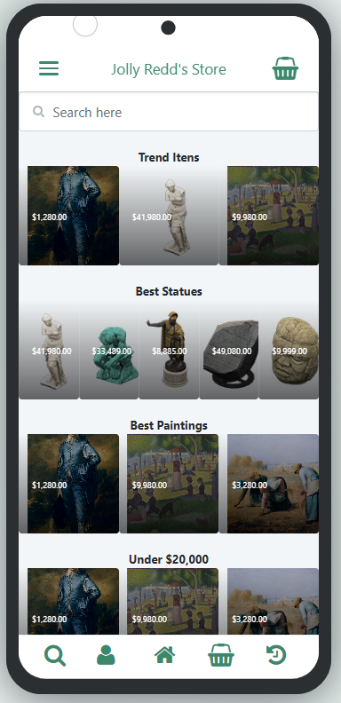

# Fictitious Art E-commerce with API Integration and Mobile Functionalities in OutSystems

This project was developed during the last two weeks of the lab with Professor Paulo Resende, where I learned how to expose and consume APIs within an OutSystems environment. The project is a fictitious art e-commerce platform, utilizing art data from the Animal Crossing game provided by an external API. This project was completed in under 10 days, it was my first experience working with APIs and developing mobile applications in OutSystems.

## Functionalities

The project is divided into two main parts:

1.  **Mobile Application for the Customer:**

    *   **Registration:** Allows new customers to register via a form, with data persisted in both the application and the store's database via the API.
    *   **Intuitive Navigation:** All screens feature top and bottom navigation shortcuts for ease of use.
    *   **Home Screen:** Showcases a search field and four curated art selections, displayed as cards in a carousel.
    *   **Search:** Enables filtering of products by minimum and maximum price, as well as by art category.
    *   **Product Details:** Provides detailed information about each art piece, including price, description, image, artist, and creation date.
    *   **Shopping Cart:** Allows users to add products to their cart, remove items, and complete purchases, sending orders to the store.
    *   **Orders:** Displays a list of all customer orders, with the ability to view details of specific orders, including products and order status.

2.  **Web Application for the Seller:**

    *   **Product Viewing and Management:** Allows viewing of all store products, modification of data, and addition of new products. Product addition leverages the external API to fetch the art's image, name, and description.
    *   **Order Management:** Enables viewing of customer orders, checking order details, confirming item separation, updating order status, and canceling orders.
    *   **User Administration:** Provides a dedicated interface for managing users, including assigning and revoking access permissions to system functionalities.

## Screenshots/Images

1.  **Mobile Application for the Customer:**

2.  **Web Application for the Seller:**

## Architecture

The project is structured using two main modules in each application:

*   **Front-end:** Handles user interface and interaction with the back-end.
*   **Back-end:** Manages business logic, data access, and overall system functionality.

## Technologies

*   OutSystems Platform (O11)
*   External API providing art data from the Animal Crossing game

## Learnings

This project facilitated learning in the following areas:

*   Exposing and consuming REST APIs.
*   Developing mobile applications in OutSystems, including leveraging features like local storage and on-demand updates.
*   Utilizing mobile-specific resources, such as optimized navigation for smaller screens.
*   Developing responsive web applications for desktop.

## Next Steps

*   Enhance the user interface for improved intuitiveness and responsiveness.
*   Implement additional features, such as reporting and payment system integration.
*   Conduct security and performance testing to ensure system quality.
